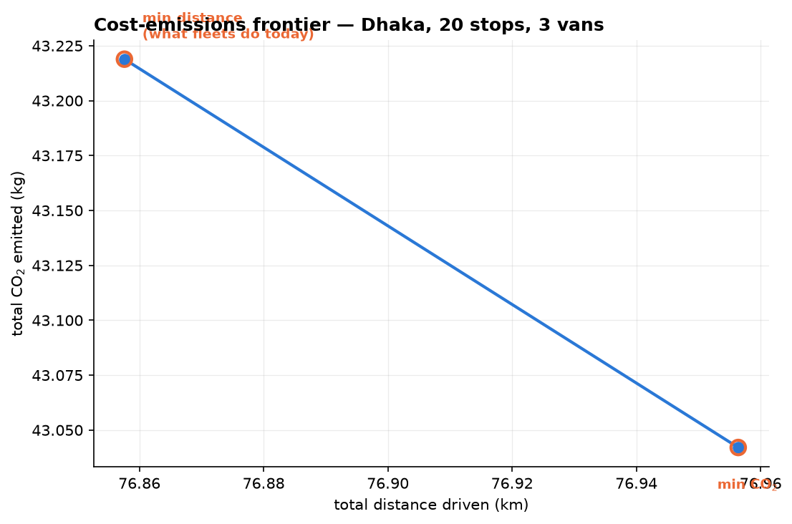

# Emissions-Aware Vehicle Routing for Last-Mile Delivery

**Does routing a delivery fleet for carbon instead of distance actually reduce carbon?**

For two Bangladeshi cities, with real road distances and a physically grounded
emission model: **no — and this repository quantifies by how little.**

---

## The question

Delivery fleets are routed to minimise **distance**, because distance is a proxy
for cost. Distance is an imperfect proxy for **carbon**, because a van's CO₂ per
kilometre is not constant. It depends on:

| Mechanism | Why it matters | Size in this model |
|---|---|---|
| **Payload** | A loaded van burns more fuel per km, so drop *order* matters | +25% empty → full |
| **Speed** | Fuel-per-km is U-shaped; gridlock is expensive | +51% at 15 vs 60 km/h |
| **Gradient** | Climbing costs `m·g·Δh`, and costs more when loaded | +0.22 kg per 50 m climbed, full van |

A distance-minimising solver is blind to all three. So this project solves the
same capacitated VRP twice — once minimising distance, once minimising modelled
CO₂ — and measures the exchange rate between them.

## The answer

> **In both cities the exchange rate is effectively zero.** The distance-optimal
> plan is within **0.41%** of CO₂-optimal in Dhaka, and is **exactly** CO₂-optimal
> in Sylhet. Emissions-aware routing buys nothing here worth having.

| | **Dhaka** | **Sylhet** |
|---|---|---|
| Stops (+ depot) | 20 | 16 |
| Terrain | 19 m spread, near-flat | 45 m spread |
| Assumed traffic speed | 15 km/h | 25 km/h |
| **Min-distance plan** | 76.86 km · 43.219 kg CO₂ | 62.57 km · 26.619 kg CO₂ |
| **Min-CO₂ plan** | 76.96 km · 43.042 kg CO₂ | 62.57 km · 26.619 kg CO₂ |
| **Trade-off** | +0.13% distance → **−0.41% CO₂** | **no change — same plan** |
| Optimality gap vs brute force | 0.00% | 0.00% |

In Dhaka the two plans differ by a **single move**: one van visits three
consecutive stops in reverse order. Nothing is reassigned between vehicles.

```
min-distance   van 2:  depot → 15 14 13 10 12 11  5 6 7  8 9 → depot
min-CO2        van 2:  depot → 15 14 13 10 12 11  7 6 5  8 9 → depot
                                                  ^^^^^ reversed
```

The reversal is the **load effect** at work. Stops 5, 6 and 7 are Dhanmondi 27
(17 kg), Lalmatia (24 kg) and Mohammadpur (54 kg). The CO₂-optimal order drops
the heaviest parcel first instead of last, so the van is 37 kg lighter on the two
arcs between those stops. That reversal is the entire benefit: **177 grams of
CO₂** on a 77 km delivery round, bought with 99 m of extra driving.



## Why the trade-off is so small

Not because the model is inert — because the two objectives are nearly collinear
on these road networks:

- `corr(distance, CO2) = 0.986` across all arcs
- CO₂-per-metre varies only **2.04×** between the cheapest and dearest arc
- the gradient term contributes a mean of **1.0%** of arc CO₂ (max 13.8%)

**This is a measured result, not a solver failure.**† Starting from the
distance-optimal solution, a local search over 2-opt, or-opt **and** inter-route
relocation — every move scored on exact true CO₂ with correct per-arc payloads —
converged in one round with **zero** improving moves. The distance optimum is a
genuine local optimum for carbon.

> † **Not reproducible from this repository.** The arc statistics above and the
> local search came from separate one-off analyses that are not included in the
> notebooks. Notebooks 04–05 independently confirm the conclusion: a 0.00%
> brute-force gap, and a Pareto frontier with only 1–2 points.

### How much terrain would it take?

Scaling Sylhet's real relief and re-solving shows the gradient mechanism is live,
and exactly where it switches on†:

| Relief | Elevation spread | Extra distance | CO₂ saved |
|---|---|---|---|
| 1× (real) | 45 m | 0.00% | 0.000% |
| 2× | 90 m | 0.00% | 0.000% |
| 5× | 225 m | 0.00% | 0.000% |
| **10×** | **450 m** | +4.09% | **0.311%** |
| 20× | 900 m | +4.09% | 1.050% |

Routing changes only past roughly **450 m of relief** — an order of magnitude more
than Sylhet has, and terrain that does not exist in the Bangladeshi delta. Even
then the exchange rate is poor: at 20× relief, 4.1% more driving buys 1.1% less
carbon.

> † **Not reproducible from this repository.** This experiment was a separate
> one-off run. The notebooks keep `TERRAIN_SCALE = 1.0` (real terrain); setting
> it in Notebooks 04 and 05 is the hook for repeating it, but the table above is
> not generated by any committed code.

**The practical conclusion for a Bangladeshi fleet: keep minimising distance.**
The carbon lever is elsewhere — vehicle choice, load consolidation, fleet
electrification — not route topology.

---

## Method

### 1. Real road network

Distances and travel times come from **OSRM** over OpenStreetMap. Straight-line
distance would have invalidated the study outright:

| | Dhaka | Sylhet |
|---|---|---|
| Circuity (road ÷ straight-line) | **1.476** | **1.535** |
| Asymmetric pairs (A→B ≠ B→A) | 418 / 441 | 234 / 272 |

Roads are ~50% longer than the crow flies, and one-way systems make the matrix
asymmetric — so this is an **asymmetric** CVRP, and any method assuming symmetry
would be wrong.

OSRM's default profile returns **free-flow** speeds (~47 km/h mean in Dhaka),
which is fantasy. Durations are rescaled so network-average speed matches a stated
figure per city. This is an assumption, listed under Assumptions below; unlike
load sensitivity, it has not yet been sensitivity-tested.

### 2. Emission model

```
CO2 = distance × fuel_rate(payload, speed) × 2.68 kg/L        # rolling
    + (mass × g × climb) / (eta × 35.8 MJ/L) × 2.68 kg/L      # gradient
```

- Payload dependence: linear interpolation between unladen and laden fuel rates
- Speed: U-shaped penalty, minimum near 44 km/h (∛(A / 2C) ≈ 43.7)
- Gradient: `m·g·Δh` converted to fuel via drivetrain efficiency. Descents earn
  **no** credit — a diesel van has no regenerative braking. Because total climb
  equals total descent on a closed tour, this makes the *direction* you drive a
  loop matter.

### 3. The optimisation obstacle

OR-Tools defines arc cost as `f(from, to)`. Load-dependent emissions need
`f(from, to, current_payload)` — and payload depends on the route the solver has
not yet chosen. The dependency is circular.

Resolved by **iterative arc re-costing**: solve, measure realised per-arc
payloads, rebuild the cost matrix, re-solve, repeat. This converges to a fixed
point, **not a proven optimum**, so it is validated two ways:

- **Brute force** on an 8-location sub-instance (all 5,040 tours enumerated,
  exact CO₂): heuristic gap **0.00%** in both cities.
- **Local search** from the distance optimum over 2-opt / or-opt / relocate on
  true CO₂: no improving move exists. † *One-off check, not in the notebooks
  (see note above).*

### 4. Data quality controls

Geocoding is restricted to a per-city bounding box (`bounded=True`), with a second
guard rejecting any stop more than 25 km from the depot. This is not defensive
padding: an early run resolved *"Bandar Bazar, Sylhet"* to a same-named place
45.7 km away, and that single bad point accounted for **66% of all driving** in
the scenario. Every downstream number was wrong and nothing warned us. The guards
turn that silent corruption into a loud failure.

---

## Limitations

Stated plainly, because they bound what the results mean.

1. **Dhaka's terrain is below the noise floor.** SRTM's vertical error is ~±16 m
   (LE90) and the radar partly returns off rooftops in dense cities. Dhaka's 19 m
   spread is comparable to that error, so its gradient term is unresolvable and
   should be read as zero, not as a small effect.
2. **Elevation is known only at stops**, not along roads. A route that crests a
   ridge and descends registers as flat, so gradient cost is **understated** —
   the reported gradient effect is a lower bound.
3. **The Pareto sweep is an inner approximation.** A weighted sum can only reach
   solutions on the convex hull of the true frontier; concave regions are
   unreachable at any λ. The ε-constraint method would be rigorous. Given both
   frontiers collapsed to 1–2 points, this makes little practical difference here.
4. **Emission parameters are calibrated, not measured** (see below). They are
   plausible values for a small diesel van, not figures from a dynamometer test of
   a specific vehicle.
5. **Congestion is a single scalar per city.** No time-of-day variation, no
   per-road-class speeds, no real traffic data.
6. **Two instances, one fleet, one depot each.** These are case studies. The
   conclusion "distance ≈ carbon in compact Bangladeshi last-mile" is supported
   for these instances, not proven in general.

## Assumptions

| Parameter | Value | Status | Sensitivity |
|---|---|---|---|
| Diesel CO₂ intensity | 2.68 kg/L | Physical constant | — |
| Diesel energy content | 35.8 MJ/L | Physical constant | — |
| Drivetrain efficiency | 0.35 | Standard for diesel | untested |
| Empty fuel rate | 11.0 L/100 km | **Assumption** | untested |
| Load sensitivity | +25% at full | **Assumption** | **tested — see below** |
| Dhaka traffic speed | 15 km/h | **Assumption** | untested |
| Sylhet traffic speed | 25 km/h | **Assumption** | untested |
| Van curb weight / capacity | 1500 kg / 600 kg | Scenario design | — |

The headline result is **robust to the load-sensitivity assumption**. Varying it
across 0.10–0.40 moves Dhaka's saving only between 0.40% and 0.42%:

| Load sensitivity | 0.10 | 0.15 | 0.20 | 0.25 | 0.30 | 0.40 |
|---|---|---|---|---|---|---|
| CO₂ saved (Dhaka) | 0.42% | 0.42% | 0.41% | 0.41% | 0.41% | 0.40% |
| CO₂ saved (Sylhet) | 0.00% | 0.00% | 0.00% | 0.00% | 0.00% | 0.00% |

The conclusion does not depend on getting that parameter right.

---

## Repository layout

```
notebooks/
  01_build_scenario.ipynb    addresses -> geocoding -> demands -> preview map
  02_road_network.ipynb      OSRM distance/duration matrices, elevation
  03_emissions_model.ipynb   the CO2 model + its unit tests -> emissions.py
  04_routing.ipynb           OR-Tools CVRP, both objectives, brute-force check
  05_pareto_and_maps.ipynb   lambda sweep, Pareto filter, route maps, sensitivity
  emissions.py               generated by notebook 03; imported by 04 and 05
data/                        scenario CSVs, matrices, results (committed)
outputs/                     figures and interactive route maps
```

## Reproducing

```bash
pip install ortools folium geopy polyline requests pandas numpy matplotlib
```

The city is read from an environment variable, so the whole pipeline runs for
either city without editing any notebook:

```bash
EMROUTE_CITY=dhaka jupyter nbconvert --to notebook --execute --inplace notebooks/0*.ipynb
```

Notebook 3 is city-independent and only needs running once. Parcel weights come
from a single seed (`SEED = 42`), so they are identical on every run.

Other results can drift slightly between runs, because three inputs are not fixed:

- **Live web services.** Notebooks 1 and 2 query Nominatim, OSRM and OpenTopoData,
  whose data changes over time. An OSRM update between Sep 29 and Oct 6, 2026
  moved Dhaka's min-distance plan from 77.09 km to 76.86 km. The routes and
  conclusions did not change. To reproduce the published numbers exactly, start
  from the committed CSVs in `data/` and run only Notebooks 3–5.
- **Geocoding.** Nominatim can return a slightly different point for the same
  address on repeated calls.
- **Solver time limits.** OR-Tools stops after a fixed time, so on a busier or
  slower machine it can return a different plan of near-equal cost.

Interactive route maps: [Dhaka](outputs/routes_co2_dhaka.html) · [Sylhet](outputs/routes_co2_sylhet.html)

## License

MIT
